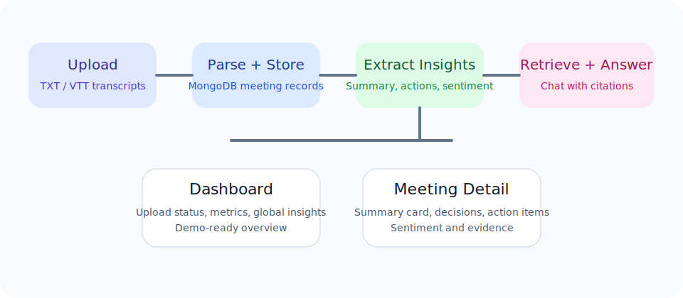
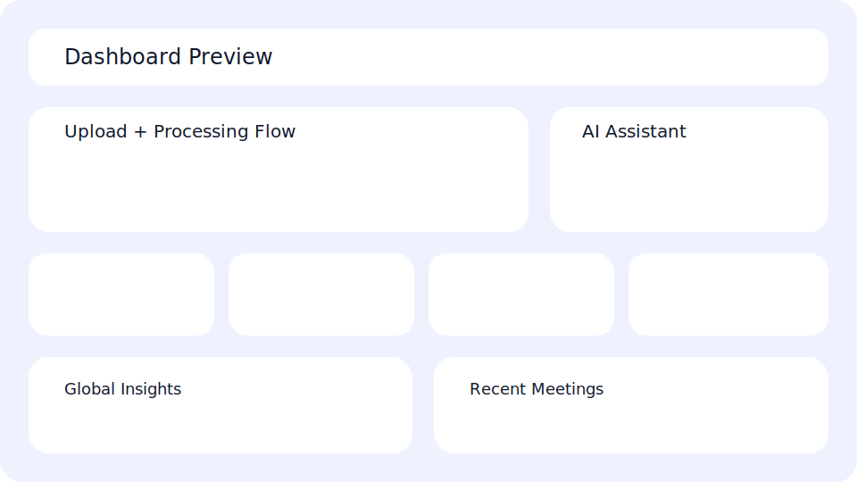
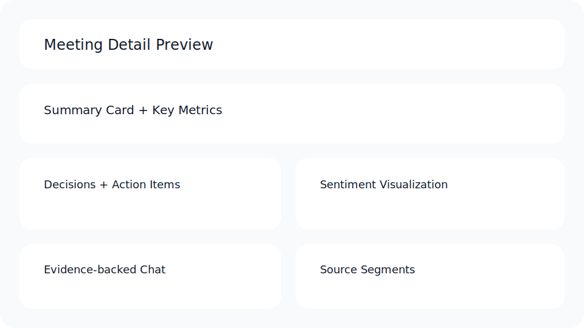

# Intelligent Meeting Hub

## Project Title
Intelligent Meeting Hub

## The Problem
Modern teams generate long meeting transcripts, but the real challenge is not transcription. The challenge is finding key decisions, action items, risks, and context quickly enough for teams to act without rereading pages of discussion or repeatedly asking what happened in a meeting.

## The Solution
Intelligent Meeting Hub turns uploaded meeting transcripts into structured, searchable outputs. The platform supports transcript upload, extracts decisions and action items, visualizes sentiment and speaker tone, and provides a chatbot-style interface that answers natural language questions with supporting citations from the underlying meeting transcript.

## Key Features
- Multi-transcript upload for `.txt` and `.vtt` files
- Automatic transcript parsing and meeting processing
- Extraction of decisions and action items with owners and deadlines
- Sentiment timeline and speaker-level sentiment insights
- Chatbot panel with grounded answers and transcript citations
- Cross-meeting dashboard with quick stats and recurring themes
- Export support for decisions and action items

## Tech Stack
- Programming Languages: JavaScript
- Frontend: React, Vite, Tailwind CSS, React Router
- Backend: Node.js, Express
- Database: MongoDB with Mongoose
- AI / Processing: Hugging Face Inference API, rule-based extraction, transcript retrieval pipeline
- Deployment: Vercel for frontend, Render for backend, MongoDB Atlas for database

## Architecture Overview
Architecture diagram:



Core flow:
1. Upload transcript files
2. Parse transcript into normalized utterances with timestamps
3. Store meetings and transcript metadata in MongoDB
4. Extract summary, decisions, action items, sentiment, and transcript chunks
5. Serve dashboard, meeting detail, export, and chat APIs
6. Answer user questions with grounded retrieval and citations

## Screenshots
Dashboard preview:



Meeting detail preview:



## Setup Instructions
### 1. Clone the repository
```bash
git clone <your-public-repo-url>
cd Intelligent_Meeting
```

### 2. Install dependencies
```bash
npm install
```

### 3. Configure environment variables
Create `server/.env` using `server/.env.example`.

Example:
```env
PORT=5000
MONGODB_URI=mongodb://127.0.0.1:27017/meeting-intelligence-hub
CACHE_TTL_MS=300000
HUGGINGFACE_API_KEY=your_huggingface_key
HUGGINGFACE_CHAT_MODEL=google/flan-t5-large
CLIENT_ORIGIN=http://localhost:5173
```

Optionally create `client/.env` for the frontend API base URL:
```env
VITE_API_BASE_URL=http://localhost:5000
```

### 4. Run the backend
```bash
npm run dev:server
```

### 5. Run the frontend
```bash
npm run dev:client
```

### 6. Open the app
Frontend:
```text
http://localhost:5173
```

Backend health check:
```text
http://localhost:5000/health
```

## Production Build
Frontend build:
```bash
npm run build:client
```

Backend start:
```bash
npm run start:server
```

## Testing
Run the lightweight validation suite:
```bash
npm run test:server
```

Current test coverage includes:
- transcript parsing
- decision and action extraction behavior
- retrieval relevance
- conversational chat answer flow

## Demo Flow
1. Upload a `.txt` or `.vtt` meeting transcript
2. Review extracted summary, decisions, and action items
3. Open the meeting detail page and inspect sentiment insights
4. Ask a natural language question in the chatbot
5. Verify the answer and the supporting citations
6. Return to the dashboard and explore global insights across meetings

Detailed script:
- [Demo Script](docs/demo-script.md)

## Sample Questions
- `Why was the API launch delayed?`
- `What decisions were made in this meeting?`
- `Who owns the next follow-up item?`
- `What concerns did Finance raise?`
- `Summarize the meeting outcome in simple terms.`

## Submission Links
- GitHub Repository: `<add-public-github-link>`
- Video Demo: `<add-demo-video-link>`
- Hosted Frontend: `<add-vercel-link>`
- Hosted Backend Health: `<add-render-health-link>`
